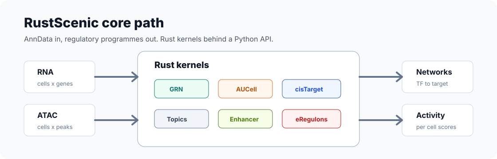

<p align="center">
  
</p>

<p align="center">
  <strong>SCENIC analysis without the setup fight.</strong>
</p>

<p align="center">
  Build regulatory networks, score regulons, link enhancers and assemble eRegulons
  from Python. One install. CPU-first. No Java, dask, CUDA or Snakemake for the core path.
</p>

<p align="center">
  <a href="https://pypi.org/project/rustscenic/">PyPI</a> |
  <a href="https://ekin-kahraman.github.io/rustscenic/">Docs</a> |
  <a href="https://doi.org/10.5281/zenodo.20246040">Zenodo DOI</a> |
  <a href="https://github.com/Ekin-Kahraman/rustscenic/actions/workflows/audit.yml">CI</a> |
  <a href="LICENSE">MIT License</a>
</p>

## Why It Exists

SCENIC and SCENIC+ are powerful, but the practical workflow often makes users
fight the stack before they can ask a biology question: old Python constraints,
dask scheduler failures, Java/Mallet topic modelling, large pinned environments,
workflow glue and hard-to-reproduce local runs.

RustScenic moves the commonly used compute path into one Rust-backed Python
package. The goal is simple: keep the biology, remove the infrastructure tax.

```bash
pip install rustscenic
```

## What It Fixes

| Legacy workflow pain | RustScenic answer |
| --- | --- |
| Fragile multi-package installs | One Python package with release wheels |
| Local CPU runs feel too slow | Rust kernels for GRN, AUCell, cisTarget, topics and enhancer links |
| Java, dask, CUDA or Snakemake become blockers | Core path runs without them |
| Multiome stages live across several tools | GRN, AUCell, motifs, topics, enhancer links and eRegulons share one API |
| Hard to defend performance claims | Benchmarks include hardware, command path, runtime, memory and output checks |

## Evidence

Head-to-head core E2E comparison against SCENIC+ on the same matrix-level path:
TF-to-gene, region-to-gene, eRegulons, gene AUCell and region AUCell.

Machine: Apple M5 laptop, 16 GB RAM, macOS arm64, Python 3.13.9, 4 CPU threads.

| Dataset | Shape | RustScenic | SCENIC+ | Speedup | Peak RSS |
| --- | ---: | ---: | ---: | ---: | ---: |
| PBMC3k dense | 2,000 cells, 4,000 genes, 8,000 peaks, 30 TFs | 4.98 s | 258.9 s | 52x | 1.21 / 1.26 GB |
| Mouse brain E18 | 1,500 cells, 3,000 genes, 6,000 peaks, 25 TFs | 2.82 s | 90.4 s | 32x | 1.65 / 2.10 GB |
| Human brain GEM-X | 2,000 cells, 4,000 genes, 8,000 peaks, 30 TFs | 7.41 s | 146.0 s | 19.7x | 2.18 / 2.19 GB |

Including data preparation, the human brain GEM-X row is `11.89 s` for
RustScenic versus `150.36 s` for SCENIC+.

The full benchmark table, commands, hardware, validation metrics and output
signatures are in [site_docs/benchmarks.md](site_docs/benchmarks.md).

## What Runs

<p align="center">
  
</p>

| Stage | RustScenic API | Reference stack |
| --- | --- | --- |
| Gene-regulatory network inference | `rustscenic.grn.infer` | `arboreto.grnboost2` |
| Per-cell regulon activity scoring | `rustscenic.aucell.score` | `pyscenic.aucell` |
| Motif-regulon enrichment | `rustscenic.cistarget.enrich` | `ctxcore` / `pycistarget` |
| scATAC topic modelling | `rustscenic.topics.fit`, `fit_gibbs` | `pycisTopic` / Mallet |
| Fragment preprocessing and QC | `rustscenic.preproc` | `pycisTopic` preprocessing |
| Enhancer-gene linking | `rustscenic.enhancer.link_peaks_to_genes` | SCENIC+ p2g linking |
| eRegulon assembly | `rustscenic.eregulon.build_eregulons` | SCENIC+ eRegulon builder |
| Pipeline orchestration | `rustscenic.pipeline.run` | SCENIC+ workflow glue |

## Quick Start

```bash
rustscenic pipeline --rna data.h5ad --tfs tfs.txt --output out/
```

```python
import anndata as ad
import rustscenic.aucell
import rustscenic.data
import rustscenic.grn

adata = ad.read_h5ad("rna.h5ad")
tfs = rustscenic.data.tfs("hs")

grn = rustscenic.grn.infer(adata, tf_names=tfs, n_estimators=5000, seed=777)

regulons = [
    (f"{tf}_regulon", grn[grn["TF"] == tf].nlargest(50, "importance")["target"].tolist())
    for tf in grn["TF"].unique()
]
auc = rustscenic.aucell.score(adata, regulons, top_frac=0.05)
```

See [examples/pbmc3k_end_to_end.py](examples/pbmc3k_end_to_end.py) for a small
real-data RNA example.

## Validation

- cisTarget AUC kernel agreement against `ctxcore.recovery.aucs`: Pearson
  `1.0000`, mean absolute difference about `2.4e-5`.
- AUCell agreement against pySCENIC on the Ziegler 2021 airway atlas: mean
  per-cell Pearson `0.984`, with `91.7%` of cells above `0.95`.
- Human brain GEM-X SCENIC+ comparison: region-to-gene Jaccard `1.000`, region
  AUCell mean Pearson `0.823`.
- External-user reports cover Kamath dopaminergic neurons and 10x human brain
  multiome data.

Validation artefacts live under [validation/](validation/). Public interpretation
lives in [site_docs/benchmarks.md](site_docs/benchmarks.md) and
[site_docs/validation.md](site_docs/validation.md).

## Scope

RustScenic focuses on the CPU matrix-level SCENIC-style compute path and the
Python workflow around it. The next evidence tier is larger real multiome inputs,
repeated runs on a second machine and full workflow coverage from raw fragments
and external motif-ranking databases.

Motif ranking databases are not bundled because public Aerts Lab databases are
large. Download them separately and pass the rankings to
`rustscenic.cistarget.enrich`.

## Documentation

- [Installation](site_docs/installation.md)
- [Quickstart](site_docs/quickstart.md)
- [API map](site_docs/api.md)
- [Benchmarks](site_docs/benchmarks.md)
- [Validation](site_docs/validation.md)
- [Scope](site_docs/limitations.md)

## Repository Layout

- `crates/` - Rust workspace for GRN, AUCell, topics, preprocessing and PyO3 bindings
- `python/rustscenic/` - Python package, CLI entry point and type stubs
- `examples/` - runnable examples on small public datasets
- `validation/` - benchmark scripts, logs and measurement reports
- `tests/` - Python and Rust test suites
- `site_docs/` - public documentation built by MkDocs

## Citation

If you use RustScenic in a paper, report, benchmark, derivative package or lab
workflow, cite the exact release used. GitHub citation metadata is in
[CITATION.cff](CITATION.cff). Zenodo concept DOI:
[10.5281/zenodo.20246040](https://doi.org/10.5281/zenodo.20246040).

RustScenic is created and maintained by Ekin Kahraman. See [AUTHORS.md](AUTHORS.md)
for attribution.

## Contact

File issues at
[github.com/Ekin-Kahraman/rustscenic/issues](https://github.com/Ekin-Kahraman/rustscenic/issues).
