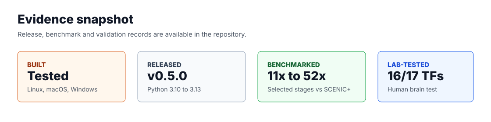

<h1 align="center">RustScenic</h1>

<p align="center">
  <strong>Faster, memory-efficient regulatory-network analysis for single-cell and multiome data.</strong>
</p>

<p align="center">
  Rust kernels for GRN inference, regulon activity, motif enrichment, topic modelling,
  enhancer links and eRegulons. Python API. CPU-first. One install.
</p>

<p align="center">
  <a href="https://ekin-kahraman.github.io/rustscenic/">Documentation</a> |
  <a href="site_docs/benchmarks.md">Benchmarks</a> |
  <a href="site_docs/validation.md">Validation</a> |
  <a href="CITATION.cff">Citation</a> |
  <a href="https://doi.org/10.5281/zenodo.20246040">Zenodo DOI</a>
</p>

<p align="center">
  <a href="https://github.com/Ekin-Kahraman/rustscenic/actions/workflows/audit.yml"></a>
  <a href="https://github.com/Ekin-Kahraman/rustscenic/actions/workflows/docs.yml"></a>
  <a href="https://github.com/Ekin-Kahraman/rustscenic/actions/workflows/nightly-real-data.yml"></a>
  <a href="https://pypi.org/project/rustscenic/"></a>
  <br>
  <a href="https://doi.org/10.5281/zenodo.20246040"></a>
  <a href="LICENSE"></a>
  <a href="https://www.python.org/"></a>
  <a href="https://www.rust-lang.org/"></a>
</p>

<p align="center">
  
</p>

## Evidence Snapshot

| Signal | Evidence |
| --- | --- |
| Built | Cross-platform Rust and Python CI, docs build, release smoke checks and nightly real-data validation workflows. |
| Released | Current release `v0.4.7`; PyPI package with Python 3.10 to 3.13 release wheels plus source distribution. |
| Benchmarked | `11x` to `52x` faster than SCENIC+ in tested real-data core E2E rows; commands, hardware, runtime, memory and output checks are committed. |
| Memory-scaled | `6.34 GB` peak RSS on a 100k-cell four-stage scale check; legacy pySCENIC reports exceed `40 GB` on similar workloads. |
| Lab-validated | Huang Lab collaborator artefacts include a 10x human brain GEM-X full monolith run recovering `16/17` expected brain TFs. |

## Highlights

- `11x` to `52x` faster than SCENIC+ in tested real-data core E2E rows
- `6.34 GB` peak RSS on a 100k-cell four-stage scale check; legacy pySCENIC reports exceed `40 GB` on similar workloads
- Current release: `v0.4.7`
- `pip install rustscenic`, with Python 3.10 to 3.13 release wheels
- Rust implementations for the matrix-heavy regulatory-network stages
- Core path runs without Java, dask, CUDA or Snakemake
- Benchmark artefacts include commands, hardware, runtime, memory and output checks

## Installation

```bash
pip install rustscenic
```

## Benchmark Evidence

Core E2E comparison on the same matrix-level regulatory path: TF-to-gene,
region-to-gene, eRegulons, gene AUCell and region AUCell.

This is a practical output-path benchmark against SCENIC+. It is not a claim
that every internal stage uses the same estimator: RustScenic enhancer linking
uses correlation over the fixed search space, while SCENIC+ uses GBM plus
Pearson scoring for region-to-gene links.

Machine: Apple M5 laptop, 16 GB RAM, macOS arm64, 4 CPU threads. RustScenic
rows used Python 3.13.9; SCENIC+ reference rows used Python 3.11.8 for its
dependency stack.
Rows can be sampled subsets; the shape column is the actual benchmark input.

| Dataset | Shape | RustScenic | SCENIC+ | Speedup | Peak RSS (RustScenic / SCENIC+) |
| --- | ---: | ---: | ---: | ---: | ---: |
| PBMC3k dense | 2,000 cells, 4,000 genes, 8,000 peaks, 30 TFs | 4.98 s | 258.9 s | 52x | 1.21 / 1.26 GB |
| PBMC10k dense | 2,000 sampled cells, 4,000 genes, 8,000 peaks, 30 TFs | 21.5 s | 241.5 s | 11x | 2.37 / 2.63 GB |
| Mouse brain E18 | 1,500 cells, 3,000 genes, 6,000 peaks, 25 TFs | 2.82 s | 90.4 s | 32x | 1.65 / 2.10 GB |
| Human brain GEM-X | 2,000 cells, 4,000 genes, 8,000 peaks, 30 TFs | 7.41 s | 146.0 s | 19.7x | 2.18 / 2.19 GB |

Including data preparation, the human brain GEM-X row is `11.89 s` for
RustScenic versus `150.36 s` for SCENIC+.

Full commands, hardware, validation metrics and output signatures are in
[site_docs/benchmarks.md](site_docs/benchmarks.md).

## Stage Coverage

| Stage | RustScenic API | SCENIC ecosystem stage covered |
| --- | --- | --- |
| TF-to-gene GRN | `rustscenic.grn.infer` | GRNBoost2-style regulatory-network inference |
| AUCell | `rustscenic.aucell.score` | Per-cell regulon activity scoring |
| cisTarget | `rustscenic.cistarget.enrich` | Motif enrichment and support filtering |
| Topics | `rustscenic.topics.fit`, `fit_gibbs` | scATAC topic modelling |
| ATAC preprocessing | `rustscenic.preproc` | Fragment matrix building and QC |
| Enhancer links | `rustscenic.enhancer.link_peaks_to_genes` | Peak-to-gene linking |
| eRegulons | `rustscenic.eregulon.build_eregulons` | Enhancer-linked regulon assembly |
| Orchestration | `rustscenic.pipeline.run` | Staged workflow across RNA and multiome inputs |

## Quick Start

```python
import anndata as ad
import rustscenic.aucell
import rustscenic.data
import rustscenic.grn

adata = ad.read_h5ad("rna.h5ad")
tfs = rustscenic.data.tfs("hs")

grn = rustscenic.grn.infer(adata, tf_names=tfs, n_estimators=5000, seed=777)

regulons = [
    (f"{tf}_regulon", grn[grn["TF"] == tf].nlargest(50, "importance")["target"].tolist())
    for tf in grn["TF"].unique()
]
auc = rustscenic.aucell.score(adata, regulons, top_frac=0.05)
```

Command line:

```bash
rustscenic pipeline --rna data.h5ad --tfs tfs.txt --output out/
rustscenic grn --expression rna.h5ad --tfs tfs.txt --output grn.parquet
rustscenic aucell --expression rna.h5ad --regulons grn.parquet --output aucell.parquet
rustscenic topics --expression atac.h5ad --output topics.parquet --n-topics 30
rustscenic cistarget --rankings rankings.feather --regulons regulons.tsv --output motifs.parquet
```

See [examples/pbmc3k_end_to_end.py](examples/pbmc3k_end_to_end.py) for a small
real-data RNA example.

## Validation

| Validation axis | Result |
| --- | --- |
| cisTarget kernel | Pearson `1.0000` against `ctxcore.recovery.aucs`; mean absolute difference about `2.4e-5`. |
| AUCell parity | Ziegler 2021 airway atlas mean per-cell Pearson `0.984`; `91.7%` of cells above `0.95`. |
| Human brain GEM-X benchmark | Region-to-gene Jaccard `1.000`; region AUCell mean Pearson `0.823`. |
| Collaborator lab artefact | 10x human brain multiome full monolith run recovered `16/17` expected brain TFs. |
| Open parity targets | Gene AUCell Pearson `0.386` and eRegulon edge Jaccard `0.161` on the human brain GEM-X row. |

Validation artefacts live under [validation/](validation/). Public interpretation
lives in [site_docs/benchmarks.md](site_docs/benchmarks.md) and
[site_docs/validation.md](site_docs/validation.md).

## Current Boundaries

- The headline benchmark is the core matrix-level E2E path, not every possible
  raw-fragment and motif-database workflow.
- GRN, gene AUCell and eRegulon edge agreement are not claimed to be
  bit-identical to SCENIC+; see [Benchmarks](site_docs/benchmarks.md) for the
  parity metrics.
- Larger repeated real-data runs and second-machine measurements are the next
  benchmark tier.

## Documentation

- [Installation](site_docs/installation.md)
- [Quickstart](site_docs/quickstart.md)
- [API map](site_docs/api.md)
- [Benchmarks](site_docs/benchmarks.md)
- [Validation](site_docs/validation.md)
- [Scope](site_docs/limitations.md)

## Citation

If you use RustScenic in a paper, report, benchmark, derivative package or lab
workflow, cite the exact release used. GitHub citation metadata is in
[CITATION.cff](CITATION.cff). Zenodo concept DOI:
[10.5281/zenodo.20246040](https://doi.org/10.5281/zenodo.20246040).

RustScenic is created and maintained by Ekin Kahraman. See [AUTHORS.md](AUTHORS.md)
for attribution.
