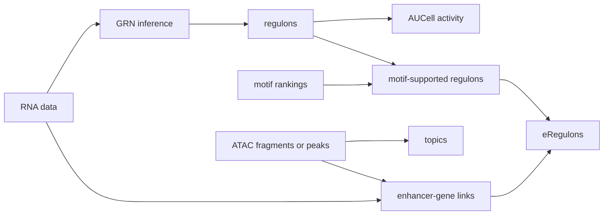

# rustscenic

[](https://github.com/Ekin-Kahraman/rustscenic/actions/workflows/audit.yml)
[](https://github.com/Ekin-Kahraman/rustscenic/actions/workflows/docs.yml)
[](https://pypi.org/project/rustscenic/)
[](LICENSE)
[](https://www.python.org/)
[](https://www.rust-lang.org/)
[](python/rustscenic/py.typed)

Rust + PyO3 implementations of the main SCENIC / SCENIC+ compute stages:
GRN inference, AUCell, topic modelling, cisTarget, ATAC preprocessing,
enhancer-gene linking, and eRegulon assembly.

```bash
pip install rustscenic
```

The package has five runtime dependencies: `numpy`, `pandas`, `pyarrow`,
`scipy`, and `anndata`. It supports Python 3.10 to 3.13. Published v0.4.4
wheels cover Linux and macOS on x86_64/aarch64; current CI and the release
workflow also cover Windows x64 for the next release. Type stubs ship in the
wheel via PEP 561.

## Why this exists

SCENIC and SCENIC+ are useful regulatory-network workflows, but the Python
stack around `arboreto`, `pyscenic`, `pycisTopic`, Java/Mallet, dask, and large
conda environments is hard to keep installable on current Python. rustscenic
keeps the user-facing workflow in Python while moving the core kernels into
Rust.

The goal is not exact line-by-line cloning. The target is a smaller,
deterministic, CPU-first implementation with clear failure modes on real atlas
data: ENSEMBL `var_names`, duplicate symbols, backed AnnData, and
UCSC/Ensembl chromosome naming are tested explicitly.

## Current status

Current PyPI release: **v0.4.4**.

v0.4.4 adds Normalised Enrichment Score (NES) filtering for cisTarget output
and removes stale `pruned_regulons.json` files when an output directory is
reused. On the PBMC granulocyte 10k validation run, NES >= 3.0 reduced
cisTarget rows from 1,578,204 to 83,569 while preserving all 10 canonical TFs.
See [CHANGELOG.md](CHANGELOG.md) and [validation/](validation/) for evidence
and caveats.

Known gaps before calling this a full SCENIC+ replacement:

- refreshed AUCell timings against current upstream stacks
- region-cisTarget parity checks on real region-ranking databases
- six-dataset v0.4.x benchmark sweep
- cell-type enrichment checks for the biology claim, not only TF-name recovery
- smoother raw 10x `pipeline.run` input without caller-side ATAC subsetting

## Compute path



| Stage | rustscenic API | Reference stage |
|---|---|---|
| Gene-regulatory network inference | `rustscenic.grn.infer` | `arboreto.grnboost2` |
| Per-cell regulon activity | `rustscenic.aucell.score` | `pyscenic.aucell.aucell` |
| Online VB topic modelling | `rustscenic.topics.fit` | `pycisTopic` using gensim VB |
| Collapsed-Gibbs topic modelling | `rustscenic.topics.fit_gibbs` | `pycisTopic` using Mallet |
| Motif-regulon enrichment | `rustscenic.cistarget.enrich` | `pycistarget` AUC kernel |
| ATAC fragments to cells x peaks | `rustscenic.preproc.fragments_to_matrix` | `pycisTopic` fragment loader |
| Cell QC | `rustscenic.preproc.qc` | `pycisTopic.qc` |
| Enhancer-gene correlation | `rustscenic.enhancer.link_peaks_to_genes` | `scenicplus` p2g linking |
| eRegulon assembly | `rustscenic.eregulon.build_eregulons` | `scenicplus` eRegulon builder |
| End-to-end orchestrator | `rustscenic.pipeline.run` | `scenicplus` Snakemake |

Bundled TF lists:

- HGNC human TFs: 1,839 entries
- MGI mouse TFs: 1,721 entries

Use `rustscenic.data.tfs("hs")` or `rustscenic.data.tfs("mm")`. Motif ranking
databases are not bundled because the aertslab feather files range from
hundreds of MB to tens of GB; fetch them with
`rustscenic.data.download_motif_rankings` or pass a loaded rankings DataFrame
to `cistarget.enrich`.

## Quick example

RNA GRN plus AUCell on an AnnData object:

```python
import anndata as ad
import rustscenic.aucell
import rustscenic.data
import rustscenic.grn

adata = ad.read_h5ad("rna.h5ad")
tfs = rustscenic.data.tfs("hs")

grn = rustscenic.grn.infer(adata, tf_names=tfs, n_estimators=5000, seed=777)

regulons = [
    (f"{tf}_regulon", grn[grn["TF"] == tf].nlargest(50, "importance")["target"].tolist())
    for tf in grn["TF"].unique()
]
auc = rustscenic.aucell.score(adata, regulons, top_frac=0.05)
```

Full script: [examples/pbmc3k_end_to_end.py](examples/pbmc3k_end_to_end.py).
It runs the PBMC-3k RNA example in about 3 minutes on an 8-core laptop with
`n_estimators=500`. Collaborator smoke-test instructions are in
[docs/tester-quickstart.md](docs/tester-quickstart.md).

## Evidence summary

Same input on both sides unless stated otherwise. Raw logs and JSON artefacts
live under [validation/](validation/).
For the public benchmark matrix with dataset, command, hardware, baseline,
runtime, memory, parity metric and biological sanity check, see
[site_docs/benchmarks.md](site_docs/benchmarks.md).

| Axis | Reference stack | rustscenic |
|---|---|---|
| Fresh Python 3.10 to 3.13 install | `arboreto` breaks on current `dask_expr`; `pyscenic` imports can fail on removed `pkg_resources` | PyPI wheels and sdist install; core APIs import |
| AUCell, Ziegler atlas, 31,602 cells x 59 regulons | 6.81 s using `pyscenic` | 0.25 s |
| AUCell, 10x Multiome, 10,290 cells x 1,457 regulons | 18.6 s using `pyscenic` | 0.21 s |
| Peak RSS, 4 stages on 100,000 cells x 20,292 genes | reported above 40 GB | 6.3 GB |
| cisTarget kernel vs `ctxcore.recovery.aucs` | reference | Pearson 1.0000, mean abs diff 2.4e-5 |
| AUCell per-cell Pearson vs `pyscenic`, Ziegler atlas | reference | 0.984 mean; 91.7% of cells above 0.95 |
| Canonical airway TFs, Ziegler n=14 | 8/14 hits using `pyscenic` unit weights | 8/14 hits, same 5/14 misses |
| Same-seed threaded determinism | no, due to dask non-determinism | bit-identical output |
| Runtime dependencies | 40+ | 5 |

Interpretation:

- AUCell and cisTarget are the strongest parity and performance stories.
- GRN preserves coarse biological signal, but fine-grained edge ranking differs
  from `arboreto`. PBMC-3k per-edge Spearman is 0.611, with downstream AUCell
  still about 0.99 per-cell against `pyscenic`.
- Topics are not a speed win against Mallet. Collapsed Gibbs improves topic
  diversity relative to Online VB, but Mallet remains the stronger reference
  for fine-grained topic coherence.

## Kuan-lin Huang Lab validation

These are collaborator-controlled validations from Kuan-lin Huang Lab users of
rustscenic, with linked issues, PRs, and committed JSON artefacts. They are
separate from the maintainer-run reference parity benchmarks above, but they are
not generic community anecdotes.

| Reporter | Dataset | Stages | Result | Evidence |
|---|---|---|---|---|
| [@Skycr](https://github.com/Skycr) | Kamath et al. 2022 midbrain dopaminergic neurons, 15,684 cells | GRN + cisTarget | 266,805 GRN edges, 9 regulons, 9/9 expected DA-neuron TFs recovered | [issue #68](https://github.com/Ekin-Kahraman/rustscenic/issues/68), [PR #71](https://github.com/Ekin-Kahraman/rustscenic/pull/71), [JSON](validation/community/kamath_da_grn.json) |
| [@lmVl12](https://github.com/lmVl12) | 10x Multiome GEM-X 10k human brain, immune-subsetted 8,215 cells | GRN + AUCell + topics | 4,293,902 GRN edges, 1,748 regulons, non-empty AUCell/topic outputs | [issues #69](https://github.com/Ekin-Kahraman/rustscenic/issues/69), [#70](https://github.com/Ekin-Kahraman/rustscenic/issues/70), [PR #74](https://github.com/Ekin-Kahraman/rustscenic/pull/74), [JSON](validation/community/human_brain_10k_v0.4.1.json) |

## Per-stage detail

### GRN

| Measurement | Value |
|---|---|
| Per-edge Spearman vs `arboreto`, PBMC-3k, n_estimators=5000 | 0.611 on 480,680 shared edges |
| Within-TF Spearman, PBMC-3k | mean 0.632, median 0.649 across 1,274 TFs |
| Per-edge Spearman vs `arboreto`, multiome3k | 0.58 on 816k shared edges |
| TRRUST known TF-target recovery, PBMC-3k | 17/18 |
| PBMC lineage TF recovery | 8/8 |
| Cortex marker TFs present, mouse E18 multiome | 9/9 by name, not cell-type enrichment |
| MITF activity, Tirosh melanoma malignant vs TME | 3.48x |
| PBMC-3k wall time, n_estimators=5000 | 214 s vs 381 s for sync-mode `pyscenic`; not apples-to-apples against dask-parallel |
| 100k-cell bootstrap, n_estimators=100 | 17 min, 5.0 GB peak RSS |

At high cell counts, GRN target blocking is adaptive by default. Users can
force a target block size with:

```python
rustscenic.grn.infer(..., target_block_size=32)
```

The edge-ranking caveat is real. Histogram GBM quantisation and independent
implementation details produce moderate edge-level agreement with `arboreto`.
The downstream AUCell agreement is much higher because the coarse regulon signal
is preserved.

### AUCell

| Measurement | Value |
|---|---|
| Per-cell Pearson vs `pyscenic`, 10x Multiome | 0.988 mean; 99.5% of cells above 0.95 |
| Per-cell Pearson vs `pyscenic`, Ziegler atlas | 0.984 mean; 91.7% of cells above 0.95 |
| Per-regulon Pearson, 10x Multiome | 0.87 mean; 90.5% above 0.80 |
| Exact top-regulon-per-cell match, Multiome | 88.4% |
| Wall time, 10k cells x 1,457 regulons | 0.21 s vs 18.6 s for `pyscenic` |
| 100k cells x 500 regulons | 10 s, 5.6 GB peak RSS |

### Topics

Two algorithms ship:

- `rustscenic.topics.fit`: Online VB LDA, fastest at K <= 10
- `rustscenic.topics.fit_gibbs`: collapsed Gibbs, closer to Mallet's algorithm
  class; pass `n_threads=N` for parallel AD-LDA

Real PBMC 3k Multiome ATAC, 1,500 cells x 98,319 peaks, K = 30:

| Tool | Wall | Unique topics | Top-10 NPMI mean |
|---|---:|---:|---:|
| `rustscenic.topics.fit` | 104 s | 2/30 | +0.012 |
| `rustscenic.topics.fit_gibbs`, serial | 191 s | 22/30 | +0.031 |
| `rustscenic.topics.fit_gibbs`, 8 threads | 84 s | 25/30 | +0.019 |
| Mallet reference | n/a | 24/30 | 0.196, extrinsic protocol |

Collapsed Gibbs gives more distinct topics than Online VB on sparse scATAC at
K = 30. The Mallet NPMI value uses a different external protocol, so compare
directionally, not as an absolute same-protocol score. Reproduce with
`python validation/scaling/bench_npmi_head_to_head.py` and
`python validation/scaling/bench_gibbs_parallel.py`.

### cisTarget

Validated on the aertslab hg38 v10 feather database, 5,876 motifs x 27,015
genes.

| Measurement | Value |
|---|---|
| Per-regulon Pearson vs `ctxcore.recovery.aucs`, 58 TRRUST regulons | 1.0000 |
| Mean absolute difference vs `ctxcore` | 2.4e-5 |
| Self-consistency, motif's own top-500 genes rank #1 | 10/10 |
| TRRUST at scale, 166 TFs with at least 10 targets | TF-annotated motif ranks #1 for 19% |
| Same benchmark, any TF motif in top 100 | 68% to 100%, depending on regulon size |
| Mouse mm10 cross-species, 5 TRRUST TFs | 2/5 rank #1, 4/5 in top 5 |
| 100k-cell workload x 100 regulons | 2.6 s, 6.3 GB peak RSS |

The 19% rank-1 rate reflects mismatch between TRRUST targets and motif-binding
rankings. It is not a numerical-kernel issue; the kernel matches `ctxcore` at
float32 precision.

### End-to-end and scaling

| Pipeline | Wall | Peak RSS | Stages |
|---|---:|---:|---|
| Reference stack, 10x Multiome 3k | 11.8 min | n/a | 4 |
| rustscenic, 10x Multiome 3k | 9.1 min | n/a | 4 |
| rustscenic, 10x PBMC 3k multiome, v0.3.9 | 7.5 min | 3.67 GB | 7 |
| rustscenic, 10x brain E18 5k multiome, v0.3.10 | 13.8 min | 4.01 GB | 7 |
| rustscenic, 10x PBMC granulocyte 10k multiome, v0.4.3 | 38.1 min | 5.39 GB | 7 |
| rustscenic, 100k synthetic multiome E2E, v0.3.10 | 12.7 min | 7.09 GB | 7 |
| rustscenic, 200k synthetic multiome E2E, v0.3.10 | 16.8 min | 7.44 GB | 7 |

Real 10x multiome scaling from 2,767 to 11,620 cells:

- cell count: 4.2x
- wall time: 5.1x, slope about 1.21 over the full span
- peak RSS: 1.47x
- latest 10k run recovered 10/10 canonical PBMC and granulocyte TFs by name
- brain E18 5k run recovered 9/9 cortex TFs by name

These are name-presence checks against regulon output, not cell-type enrichment
tests. The per-cluster AUCell F-test is still a v0.5 validation task.

## Scope and alternatives

rustscenic covers CPU SCENIC / SCENIC+ compute stages. Adjacent tools with
different scope:

- GPU workflows: [flashSCENIC](https://github.com/haozhu233/flashscenic)
- Full enhancer-aware SCENIC+ workflow: [scenicplus](https://github.com/aertslab/scenicplus)
- TF-activity scoring from prebuilt regulons: [decoupler-py](https://saezlab.github.io/decoupler-py/)
- R Bioconductor ecosystem: original R-SCENIC and [Epiregulon](https://www.nature.com/articles/s41467-025-62252-5)

## CLI

```bash
# End-to-end orchestrator:
rustscenic pipeline --rna data.h5ad --tfs tfs.txt --output out/

# Per-stage commands:
rustscenic grn --expression data.h5ad --tfs tfs.txt --output grn.parquet
rustscenic aucell --expression data.h5ad --regulons grn.parquet --output auc.parquet
rustscenic topics --expression atac.h5ad --output topics --n-topics 30
rustscenic cistarget --rankings motifs.feather --regulons grn.parquet --output enrichment.tsv
```

## Repository layout

- `crates/`: Rust workspace, including `rustscenic-{grn,aucell,topics,preproc,py}`
- `python/rustscenic/`: Python package, CLI entry point, and type stubs
- `examples/pbmc3k_end_to_end.py`: RNA GRN + AUCell example on PBMC-3k
- `validation/`: benchmark scripts, JSON artefacts, and validation summaries
- `tests/`: pytest suite, 202 collected tests; latest local run was 201 passed and 1 skipped
- `manuscript/`: preprint source
- `site_docs/`: MkDocs source for external-reader documentation

Rust crate tests currently total 60, excluding doctest placeholders.

## Development quality

CI covers:

- Rust build, clippy, and unit tests on macOS, Ubuntu, and Windows
- Python wheel build, install, import smoke, pytest, quickstart, and PBMC
  end-to-end example across Python 3.10 to 3.13 on macOS, Ubuntu, and Windows
- optional dependency install matrix for core, examples, validation, reference,
  and benchmarks extras
- docs build with MkDocs
- weekly Kamath real-data validation
- tag-gated release wheels for Linux x86_64/aarch64, macOS x86_64/aarch64,
  Windows x64, plus sdist

## Licence

MIT. Algorithm implementations follow the aertslab Python references. Method
credit belongs to Aibar et al. 2017 for SCENIC, Bravo Gonzalez-Blas et al. 2023
for SCENIC+, and Hoffman, Blei, and Bach 2010 for Online VB LDA.

## Citation and attribution

If you use rustscenic in a paper, report, benchmark, derivative package, or lab
workflow, cite the exact release used. GitHub citation metadata is in
[CITATION.cff](CITATION.cff).

rustscenic is created and maintained by Ekin Kahraman. See [AUTHORS.md](AUTHORS.md)
and [docs/collaboration-and-authorship.md](docs/collaboration-and-authorship.md)
for contribution and authorship expectations.

## Contact

File issues at [github.com/Ekin-Kahraman/rustscenic/issues](https://github.com/Ekin-Kahraman/rustscenic/issues).
Bug, correctness, and validation-report templates pre-fill the fields needed for
triage. For coordinated vulnerability disclosure, see [SECURITY.md](SECURITY.md).
