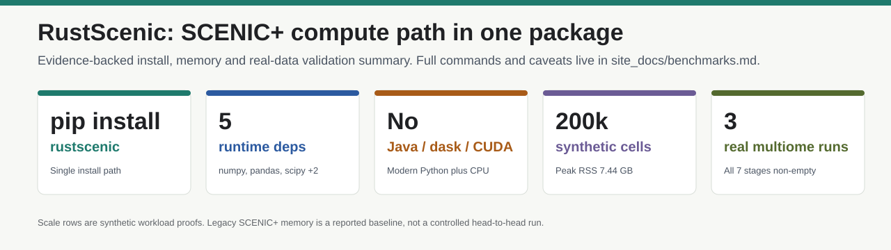
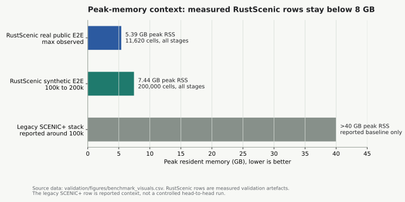

# Benchmarks

This page is the external-reader benchmark matrix. It separates controlled
head-to-head measurements from directional adoption evidence and labels rows
where the next refresh is still pending.

Cells that use `...` point to long local artefact paths. Exact command
templates for the most important rows are listed after the matrix.

## Visual Summary





The visuals are generated from `validation/figures/benchmark_visuals.csv` by
`validation/figures/make_benchmark_visuals.py`. The 100k and 200k rows are
synthetic scale proofs. The legacy SCENIC+ >40 GB memory row is a reported
baseline, not a controlled head-to-head run.

## Benchmark Matrix

| Dataset / workload | Command | Hardware / environment | Baseline | Runtime and memory | Parity metric | Biological sanity check | Evidence and caveat |
| --- | --- | --- | --- | --- | --- | --- | --- |
| Fresh install on Python 3.10 to 3.13 | `pip install rustscenic` plus CI extra-matrix import checks | GitHub Actions Linux and macOS; release workflow also covers Windows x64 wheels | Current `arboreto` and `pyscenic` install path | RustScenic wheels and sdist install; core APIs import | Installability, not biological parity | Not applicable | Main claim is single-install usability. Pinned reference Docker remains the controlled route for old `pyscenic` / `arboreto` comparisons. |
| GRN parity on Scanpy PBMC 3k, 2,700 cells x 13,714 genes, 1,274 TFs, `n_estimators=5000` | `python validation/run_rustscenic_grn_pbmc3k.py ...` then `python validation/grn_parity_v0310.py ...` | 10-core Apple M5 for RustScenic; `rustscenic-ref:0.12.1` Docker for `arboreto` | `arboreto.grnboost2` inside pinned `pyscenic` reference image | RustScenic 214.31 s, 0.37 GB peak RSS; reference sync path 380.94 s | Per-edge Spearman 0.6113 on 480,680 shared edges; within-TF Spearman mean 0.6317; top-10k Jaccard 0.2012 | 17 of 18 known PBMC TF-target edges recovered in the related PBMC biology audit | Runtime is not a strict apples-to-apples speed claim because the reference uses the sync path after modern Dask failures. Fine-grain edge ranks differ, but downstream AUCell agreement is stronger. |
| AUCell on Ziegler 2021 airway atlas, 31,602 cells x 59 regulons | `python scripts/03_headtohead_pyscenic_aucell.py` in [`rustscenic-airway-case`](https://github.com/Ekin-Kahraman/rustscenic-airway-case) | Same local venv for both tools; pre-v0.4.x measurement | `pyscenic.aucell` | RustScenic 0.25 s vs `pyscenic` 6.81 s | Mean per-cell Pearson 0.984; 91.7 percent of cells above 0.95 | RustScenic and `pyscenic` recover the same 8 of 14 canonical airway TFs, with the same miss set | Timing refresh is deferred to v0.5. This row is still useful for numerical parity and biological sanity, but should not be used as the only current runtime claim. |
| AUCell on 10x Multiome, 10,290 cells x 1,457 regulons | AUCell validation scripts under `validation/validate_aucell_*.py` | Same local validation host; pre-v0.4.x timing | `pyscenic.aucell` | RustScenic 0.21 s vs `pyscenic` 18.6 s | Mean per-cell Pearson 0.988 on the smaller paired audit; exact top-regulon-per-cell match 88.4 percent | PBMC lineage TF discrimination passes 8 of 8 in the related PBMC-10k check | Timing refresh is planned for v0.5. The numerical row remains a strong compatibility signal. |
| cisTarget AUC kernel on aertslab hg38 v10 feather DB, 5,876 motifs x 27,015 genes | `rustscenic.cistarget.enrich(...)`; reference comparison captured in validation summary | Hardware not captured in the current summary artefact | `ctxcore.recovery.aucs` / `pycistarget` kernel | 58-regulon parity run is correctness-focused, not a speed story; 100k workload row reports 2.6 s and 6.34 GB peak RSS | Pearson 1.0000, all 58 regulons above 0.9999, mean absolute difference about 2.4e-5 | Self-motif top-500 check recovers rank 1 for 10 of 10 motifs; TRRUST scale benchmark has 19 percent rank-1 and 68 to 100 percent any-in-top-100 | Exact AUC kernel parity is strong. Region-ranking SCENIC+ parity on real cistromes remains a v0.5 credibility gate. |
| Peak calling on 10x PBMC 3k Multiome fragments, 44,109,954 fragments, 3,000 called barcodes | `python validation/scaling/bench_macs2_head_to_head.py --tool macs2`, then `--tool rustscenic`, then `--tool f1` | macOS 25.4 arm64, 32 GB RAM, same hardware and same fragments | MACS2 2.2.9.1 | RustScenic 8.4 s, 77,556 peaks; MACS2 83.3 s, 122,330 peaks | F1 overlap 0.825 against MACS2 intervals; recall 82.7 percent, precision 82.2 percent | Interval-overlap quality check only; downstream biology is assessed through topics, cisTarget and eRegulon rows | RustScenic uses Corces-style consensus peaks, so exact MACS2 equality is not expected. |
| Topic modelling on PBMC 3k Multiome ATAC, 3,000 cells x 98,319 peaks, 20.97M non-zero entries | `python validation/scaling/bench_gensim_lda.py` | macOS 25.4 arm64, 32 GB RAM, same cells and peaks | `gensim.models.LdaModel` | K=10: RustScenic VB 31.6 s vs gensim 21.7 s. K=30: RustScenic VB 42.6 s vs gensim 26.4 s | Speed comparison only | Not a biology row | Gensim wins raw VB wall time at this shape. RustScenic's claim here is integrated single-install workflow, not speed leadership. |
| Topic quality on PBMC 3k Multiome ATAC, 1,500 cells x 98,319 peaks, K=30 | `python validation/scaling/bench_npmi_head_to_head.py` and `python validation/scaling/bench_gibbs_parallel.py` | Same local validation host; parallel row uses 1, 2, 4 and 8 threads | RustScenic Online VB and Mallet-class collapsed Gibbs; Mallet reference reported separately | VB 104.0 s, 2/30 unique topics, NPMI +0.0115. Gibbs 191.3 s, 22/30 unique topics, NPMI +0.0312. Gibbs 8-thread 83.6 s, 25/30 unique topics | Gibbs adds 20 unique topics over VB and improves intrinsic NPMI by +0.0196 | Larger 10k PBMC ATAC audit shows ARI vs Leiden comparable to Mallet, but Mallet wins coherence and topic count | Use Gibbs when topic diversity matters. Mallet remains the stronger fine-grained reference. |
| Real full SCENIC+ E2E on 10x PBMC 3k multiome | `bash validation/multiome_pipeline_run_v0.3.9_smoke.sh` | Apple M5; Python 3.13 local validation run | No full direct `scenicplus` baseline for this exact row | 451 s, 3.67 GB peak RSS, all user-facing stages non-empty | Stage-completion and output-inventory parity, not strict cross-tool parity | 5 of 5 canonical PBMC TFs in regulon set in the earlier PBMC real-data smoke; this run produces GRN, AUCell, topics, cisTarget, enhancer links and eRegulons | Historical v0.3.9 row. Kept as first real `pipeline.run` proof. |
| Real full SCENIC+ E2E on 10x E18 mouse brain 5k multiome, 4,770 RNA cells x 21,664 genes and 172,193 ATAC peaks | `bash validation/multiome_pipeline_run_v0.3.10_brain_smoke.sh` | Apple M5, Darwin 25.4 arm64, 10 CPUs, Python 3.13.9 | No strict cross-tool baseline | 826.4 s, 4.01 GB peak RSS | All outputs non-empty: GRN, regulons, cisTarget, enhancer links, eRegulons and integrated AnnData | 9 of 9 cortex TFs recovered by name: Pax6, Neurod2, Sox2, Ascl1, Tbr1, Neurog2, Fezf2, Eomes, Foxg1 | Name-presence is not cell-type enrichment. A per-cluster AUCell enrichment check remains planned. |
| Real full SCENIC+ E2E on 10x PBMC granulocyte 10k multiome, 11,620 RNA cells x 26,341 genes and 143,887 ATAC peaks | `bash validation/multiome_pipeline_run_v0.4.3_pbmc_granulocyte_10k.sh` | Apple M5, Darwin 25.4 arm64, 10 CPUs, Python 3.13.9 | No strict cross-tool baseline | 2,287.79 s, 5.39 GB peak RSS; GRN 1,794.65 s, topics 315.63 s, AUCell 0.96 s, cisTarget 2.08 s | All 7 SCENIC+ stages produce non-empty output; 2,840,537 GRN edges, 1,548 regulons, 1,578,204 cisTarget rows, 18,536 enhancer links, 486 eRegulons | 10 of 10 canonical PBMC and granulocyte TFs recovered by name | Strongest real-data full-pipeline proof. Cross-tool `pycistarget` parity on this dataset is blocked by upstream installability. |
| Real PBMC granulocyte 10k NES filtering on v0.4.4 | `bash validation/multiome_pipeline_run_v0.4.4_pbmc_granulocyte_10k_nes.sh` | Apple M5, Darwin 25.4 arm64, same dataset and hyperparameters as the v0.4.3 row | Previous v0.4.3 no-NES cistarget output | 5.14 GB peak RSS; runtime comparable to v0.4.3 row | NES >= 3.0 reduces post-AUC cisTarget rows from 1,578,204 to 83,569, selectivity 0.053 | Biological sanity remains the same name-presence check as the v0.4.3 row | Exercises the v0.4.4 orchestrator path and canonical NES threshold, not a separate dataset. |
| Synthetic 100k full SCENIC+ E2E, 100,000 cells x 15,000 genes and 50,000 peaks | `python validation/scaling/bench_e2e_100k_synthetic.py` | Hardware not captured in JSON; measured 2026-04-27 local validation | No biological baseline; synthetic scale gate | 762.6 s, 7.09 GB peak RSS | Output-shape and non-empty-stage checks: 441,734 GRN edges, 30 topics, 900 cisTarget hits, 93,750 enhancer links, 30 eRegulons | Synthetic planted structure only | Good scale proof, but not a substitute for real 100k RNA plus ATAC validation. |
| Synthetic 200k full SCENIC+ E2E, 200,000 cells x 8,000 genes and 30,000 peaks | `python validation/scaling/bench_e2e_200k_synthetic.py` | Hardware not captured in JSON; measured 2026-04-27 local validation | No biological baseline; synthetic scale gate | 1,009.3 s, 7.44 GB peak RSS | Output-shape and non-empty-stage checks: 229,687 GRN edges, 30 topics, 93,750 enhancer links, 30 eRegulons | Synthetic planted structure only | Scale proof only. Real 100k multiome remains the next credibility gate. |
| Atlas-scale GRN on 91,838-cell cellxgene microglia atlas, 58,232 genes, 50 TFs, `n_estimators=20` | Target-blocking scaling run recorded in `validation/scaling/microglia_91k_grn_scaling_target_blocked.json` | Same local atlas setup as the pre-fix run | RustScenic pre-fix implementation | 91,838-cell GRN falls from 6,590.6 s to 864.1 s; 40k to 80k segment improves from 8.0x wall jump to 2.56x | Full-run log-log slope improves to 1.15 | Biology not assessed in this scaling row | This fixes the atlas cliff, but full-TF and 5,000-estimator real atlas runs still need HPC validation. |

## Command Index

These are the command templates behind the rows a reviewer is most likely to
rerun.

### GRN PBMC 3k Parity

```bash
python validation/run_rustscenic_grn_pbmc3k.py \
  validation/parity_v0310/pbmc3k.h5ad \
  validation/parity_v0310/allTFs_hg38.txt \
  validation/parity_v0310/rustscenic_grn_pbmc3k.parquet \
  validation/parity_v0310/rustscenic_grn_pbmc3k.meta.json

docker build -t rustscenic-ref validation/reference

docker run --rm \
  -v "$PWD/validation/parity_v0310:/data" \
  -v "$PWD/validation/reference:/work/validation/reference" \
  rustscenic-ref \
  python /work/validation/reference/run_reference.py \
    --stage grn \
    --expression /data/pbmc3k.h5ad \
    --tfs /data/allTFs_hg38.txt \
    --output /data/pyscenic_grn_pbmc3k.parquet \
    --seed 777

python validation/grn_parity_v0310.py \
  validation/parity_v0310/rustscenic_grn_pbmc3k.parquet \
  validation/parity_v0310/pyscenic_grn_pbmc3k.parquet \
  validation/parity_v0310/grn_parity_pbmc3k_full.json
```

### Peak Calling Versus MACS2

```bash
python validation/scaling/bench_macs2_head_to_head.py --tool macs2
python validation/scaling/bench_macs2_head_to_head.py --tool rustscenic
python validation/scaling/bench_macs2_head_to_head.py --tool f1
```

### Topic Modelling

```bash
python validation/scaling/bench_gensim_lda.py
python validation/scaling/bench_npmi_head_to_head.py
python validation/scaling/bench_gibbs_parallel.py
```

### Real Multiome End-To-End Runs

```bash
bash validation/multiome_pipeline_run_v0.3.9_smoke.sh
bash validation/multiome_pipeline_run_v0.3.10_brain_smoke.sh
bash validation/multiome_pipeline_run_v0.4.3_pbmc_granulocyte_10k.sh
bash validation/multiome_pipeline_run_v0.4.4_pbmc_granulocyte_10k_nes.sh
```

### Synthetic Scale Runs

```bash
python validation/scaling/bench_e2e_100k_synthetic.py
python validation/scaling/bench_e2e_200k_synthetic.py
```

## What To Claim Publicly

- Strong: `pip install rustscenic`, AUCell per-cell parity, cisTarget AUC
  kernel parity, deterministic seeded execution, full real multiome
  `pipeline.run` on three public datasets, and 100k to 200k synthetic scale
  proof.
- Qualified: GRN is biologically usable but not fine-rank identical to
  `arboreto`; topic modelling is integrated and deterministic, but Mallet is
  still the stronger fine-grained topic reference.
- Do not overclaim yet: full `scenicplus` region-ranking parity, real 100k
  RNA plus ATAC full pipeline, full-TF atlas GRN at 5,000 estimators, or
  cluster-level enrichment for every biological sanity row.

## Reproduction Notes

Reference-stack commands require the `[reference]` extra or the pinned Docker
image under `validation/reference/`. Topic and peak-calling comparisons require
the `[benchmarks]` extra plus external tools where stated, such as MACS2.

The heaviest real datasets are gitignored. Download URLs and cache locations
are documented in the corresponding scripts under `validation/`.
